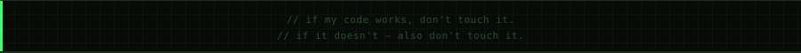

<div align="center">
  
</div>

<div align="center">
  <a href="https://github.com/4rnav-here">
    
  </a>
  &nbsp;
  
  &nbsp;
  
</div>

<br/>

---

## `▸ whoami`

```typescript
// ~/arnav.ts · last updated 2025

const arnav = {
  stack     : ["TypeScript", "Node", "React", "Python", "Go→learning"],
  loves     : ["clean APIs", "fast deploys", "systems that scale"],
  currently : "building prod-grade apps + sharpening DSA",
  seeking   : "impactful SWE roles & serious collabs",
  stance    : "strong opinions on React Hooks (ask me)",
  fuel      : "☕ coffee + curiosity",
};
```

---

## `▸ stack`

**Languages**


-0d130d?style=flat-square&logo=go&logoColor=c8a800)

**Frontend & Backend**


**Data & Infra**


---

## `▸ activity`

<div align="center">
  
</div>

<br/>

<div align="center">
  
</div>

---

## `▸ connect`

<div align="center">

[](https://github.com/4rnav-here)
[](https://arnavtrivedi.vercel.app/)
[](https://linkedin.com/in/arnavtrivedi2004)
[](https://instagram.com/arnavtrivedi_)
[](mailto:arnavtrivediofficial@gmail.com)

</div>

<br/>

<div align="center">
  
</div>